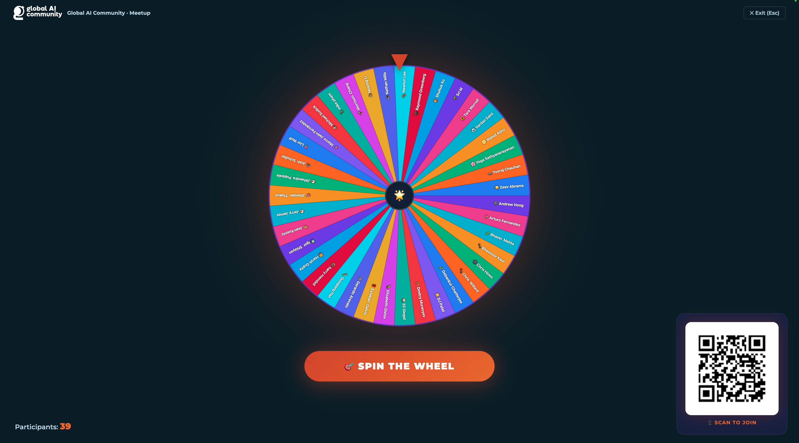

# 🎡 Wheel of Names — Global AI Community Edition

A real-time, single-file web app for spinning a wheel of names at meetups.  
Attendees join by scanning a QR code on their phone — their name appears instantly on the presenter's screen.

**Live:** <https://ma3u.github.io/wheel/>  
**Join URL:** <https://ma3u.github.io/wheel/?join>


---

## Features

| Feature | Detail |
|---|---|
| 🎡 Spinning wheel | Canvas-based, smooth quartic ease-out, tick sounds |
| 📱 QR join flow | Attendees scan → enter name → instantly queued on presenter screen |
| ⚡ Real-time sync | Firebase Realtime DB — no page refresh needed |
| 🖥️ Presentation mode | Fullscreen overlay with large wheel, big SPIN button, QR corner |
| 🔄 Multi-tab sync | `BroadcastChannel` keeps multiple presenter windows in sync |
| 🚫 Duplicate check | Case-insensitive, blocked on mobile and in presenter queue |
| 🎨 Global AI Community style | Dark navy / purple-pink gradient, Inter font |

---

## Quick Start (no Firebase)

The app works immediately — open `index.html` in a browser or visit the GitHub Pages URL.  
Without Firebase the join flow shows a "You're in the queue" confirmation; the presenter adds names manually via the sidebar.

---

## Firebase Setup (real-time join, 3 minutes)

1. Go to <https://console.firebase.google.com> → **New project**
2. Add a **Web app** (`</>`) → copy the `firebaseConfig` values
3. **Build → Realtime Database → Create database** → choose **test mode**
4. In `index.html`, replace the 7 `'REPLACE_ME'` strings in `window.FB_CFG`
5. Commit & push

---

## Repository Structure

```
wheel/
├── index.html          # Entire app — HTML + CSS + JS, single file
├── loadtest.py         # Simulate 100 concurrent joins via Firebase REST API
├── README.md
├── USER_MANUAL.md      # Instructions for presenters and attendees
├── DEVELOPER_MANUAL.md # Architecture, extension guide
└── LIVEHACK.md         # How to live-code this at a meetup
```

---

## Load Testing

```bash
# Simulates 100 concurrent joins against the real Firebase DB
python3 loadtest.py
```

See [loadtest.py](loadtest.py) for configuration.

---

## License

MIT — fork freely, demo at your community meetup.
